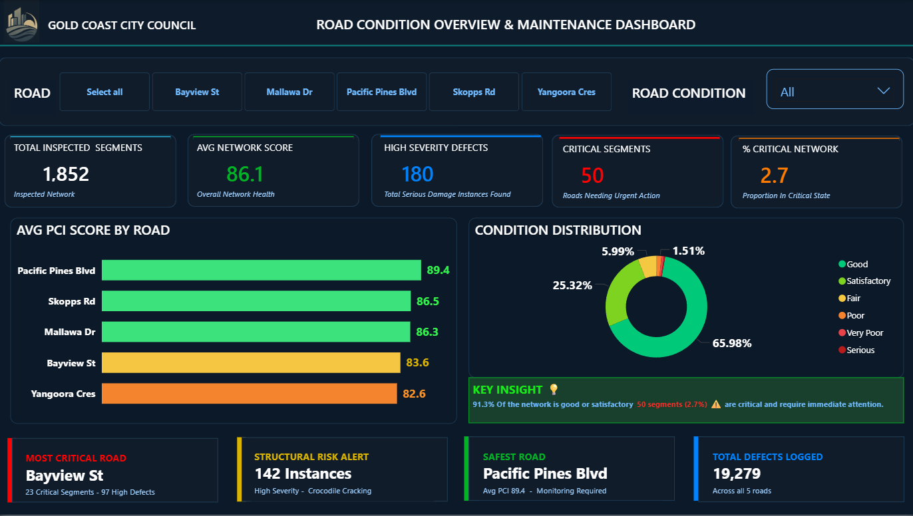
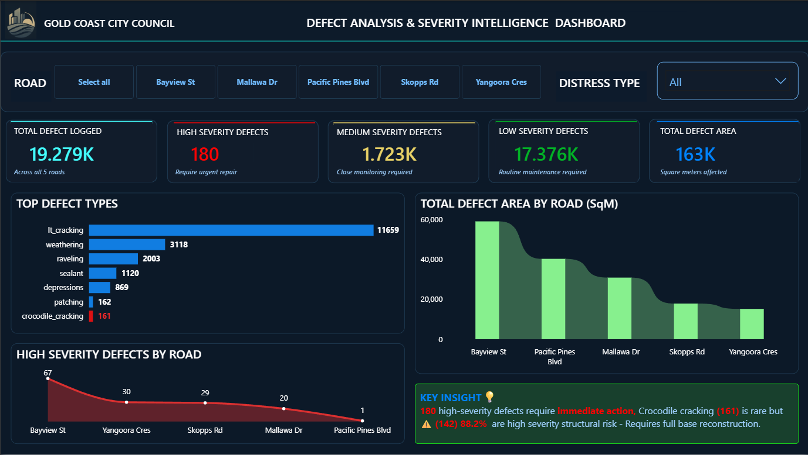
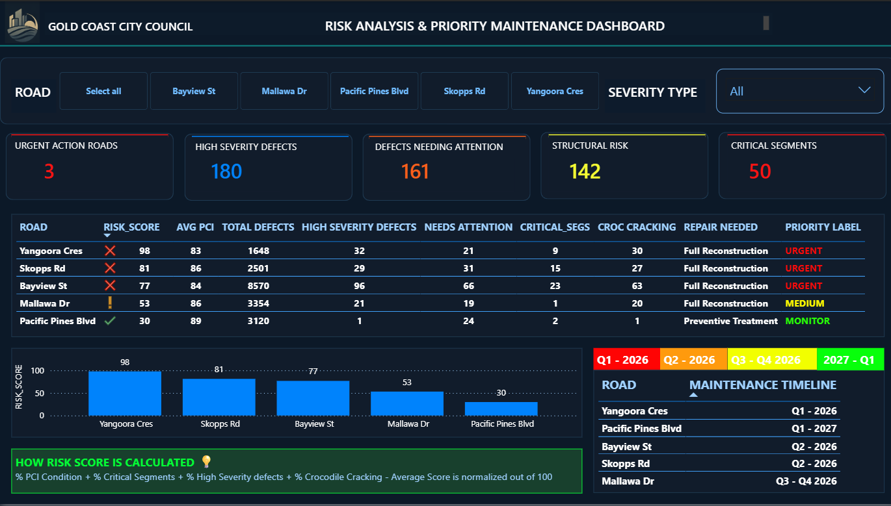

# 🛣️Geospatial Analytics PipelineGeospatial-Road-Risk-Intelligence-Analytics

---

## Executive Summary

Delivered an end-to-end geospatial analytics solution for a Queensland local government council — from LiDAR point cloud survey data through spatial database processing to a three-page interactive Power BI risk intelligence report. The solution analyses road condition and defect data across a 16.76km urban road network, producing a composite Risk Score model that objectively ranks maintenance urgency across five roads. The output enables infrastructure asset managers to direct limited capital works budget toward highest-risk roads using evidence, not assumption.

**Every metric calculates dynamically from 19,279 raw inspection records.**

---

## Business Problem

Queensland local councils commonly face reactive maintenance cycles — budget allocation driven by complaint volume rather than objective condition data. Without a structured analytical framework, high-risk roads can be deprioritised while lower-urgency requests consume available funding.

This project addressed three specific stakeholder questions:

- Which roads are deteriorating fastest and what is driving that deterioration?
- Where does structural failure risk justify immediate reconstruction spend over surface treatment?
- How should the maintenance schedule be sequenced to maximise the impact of available capital works budget?

---

## Objective

Deliver an interactive analytics solution that:

- Transforms LiDAR-derived inspection data into actionable maintenance intelligence
- Quantifies road condition risk using a reproducible, defensible composite scoring model
- Enables asset managers to rank maintenance priorities by evidence rather than assumption
- Provides engineers with defect-level intelligence to inform repair specification
- Gives executive stakeholders a network health overview in under 30 seconds

---

## Data Pipeline — End to End

```
LiDAR Point Cloud Survey
        │
        ▼
ArcGIS / PostGIS
Spatial Processing
(XYZ normalisation → PCI segment scores)
        │
        ▼
Structured CSV Export
        │
        ▼
Power Query
Data Cleaning & Transformation
        │
        ▼
Power BI Data Model
(One-to-Many relationship via Inspect_ID)
        │
        ▼
DAX Measures & Risk Score Model
        │
        ▼
3-Page Interactive Report
(Executive · Engineer · Asset Manager)
```

### Source Data

| Table | Rows | Grain | Source |
|-------|------|-------|--------|
| `Pci_Segment_Data` | 1,863 | One row per road segment | LiDAR → ArcGIS/PostGIS → CSV |
| `Pavement_Distress_Data` | 19,279 | One row per recorded defect | LiDAR → ArcGIS/PostGIS → CSV |

### Data Model

```
Pci_Segment_Data (1,863 rows)        Pavement_Distress_Data (19,279 rows)
─────────────────────────────        ────────────────────────────────────
Inspect_ID (PK) ────────────────────► Inspect_ID (FK)
Road_Name                             Road_Name
PCI_Score                             Distress_Type
PCI_Lable                             Severity
Latitude / Longitude                  Defect_Area_SqM
Length_M / Area_SqM                   Defect_Length_M

Relationship: One-to-Many
Cross-filter direction: Both
```
---
### Network Summary

- **5 roads** inspected across Queensland urban network
- **16.76 km** total network length
- **1,863 segments** assessed
- **19,279 defects** recorded across 13 distress types
- **180 high severity defects** requiring urgent intervention
- **142 high severity crocodile cracking instances** — confirmed structural base failure

---

## Methodology

### Analytical Framework

Business questions were defined across three stakeholder audiences **before any visual was built** — framework-first approach.

| Dashboard Page | Audience | Business Questions |
|----------------|----------|--------------------|
| Network Overview | Executives | Q1: Overall network health · Q2: Critical condition % · Q3: Road performance comparison · Q4: Condition distribution |
| Defect Intelligence | Engineers | Q5: Most common defect types · Q6: Structural vs cosmetic damage · Q7: High severity distribution · Q8: Surface area affected |
| Risk & Priority Maintenance | Asset Managers + Finance | Q9: Immediate intervention priorities · Q10: Repair type by road · Q11: Maintenance schedule · Q12: Risk score methodology |

### Risk Score Design

The composite Risk Score addresses a fundamental challenge in road asset management — a road with high defect volume is not necessarily more urgent than one with fewer but structurally severe defects. The model normalises four metrics against their network maximums, ensuring each dimension contributes equally regardless of scale.

Risk Score =
  (PCI Risk normalised / 17.38) × 100
+ (% Critical Segs / 5.73) × 100
+ (% High Sev Defects / 1.9417) × 100
+ (% Croc Cracking High / 100) × 100
÷ 4
---

### DAX Implementation

```dax
RISK_SCORE = 

VAR pci_inv = 100 - AVERAGE(PCI_Segment_Data[PCI_Score])
VAR norm_pci = DIVIDE(pci_inv, 17.38, 0) * 100

VAR pct_crit =
    DIVIDE(
        CALCULATE(COUNTROWS(PCI_Segment_Data), PCI_Segment_Data[PCI_Lable] IN
        {"Poor","Very Poor","Serious"}),
        COUNTROWS(PCI_Segment_Data),
        0
    ) * 100
VAR norm_crit = DIVIDE(pct_crit, 5.73, 0) * 100

VAR pct_high =
    DIVIDE(
        CALCULATE(COUNTROWS(Pavement_Distress_Data), Pavement_Distress_Data[Severity]
        = "High"),
        COUNTROWS(Pavement_Distress_Data),
        0
    ) * 100
VAR norm_high = DIVIDE(pct_high, 1.9417, 0) * 100

VAR pct_croc =
    DIVIDE(
        CALCULATE(COUNTROWS(Pavement_Distress_Data),
        Pavement_Distress_Data[Distress_Type] = "crocodile_cracking",
        Pavement_Distress_Data[Severity] = "High"),
        CALCULATE(COUNTROWS(Pavement_Distress_Data),
        Pavement_Distress_Data[Distress_Type] = "crocodile_cracking"),
        0
    ) * 100
VAR norm_croc = DIVIDE(pct_croc, 100, 0) * 100

RETURN
ROUND((norm_pci + norm_crit + norm_high + norm_croc) / 4, 1)
```
---
## Data Cleaning & Preparation

All transformation performed in Power Query — reproducible and documented:

| Issue | Resolution |
|-------|------------|
| Semicolon delimiter in source CSVs | Corrected on import |
| GEOM spatial geometry column | Removed — not required in Power BI, caused file bloat |
| 1000's of rows with null PCI scores | Removed — labelled "Not Scored" |
| 1000's of duplicate Inspect_IDs | Deduplicated — first occurrence retained |
| Severity values in lowercase | Capitalised — `high` → `High` etc. |
| Blank locality values | Replaced with "Unknown" |
| 8 redundant columns | Dropped — fid, fid_1, client_seg, stroke, dis_un_id, cell_distr, GEOM, seg |

---

## Dashboard Walkthrough

### Page 1 — Network Overview
**Audience:** Council executives · **Story:** Is our road network healthy?



The executive page delivers a 30-second network health verdict. Five KPI cards surface headline metrics. A gradient bar chart immediately shows which roads fall below the 85.8 network average. The condition donut communicates that 91.3% of the network is Good or Satisfactory — focusing attention on the 2.7% requiring budget.

---

### Page 2 — Defect Intelligence
**Audience:** Engineers · **Story:** What damage are we dealing with?



The engineering page breaks down 19,279 defect records by type, severity and road. Crocodile cracking is flagged in red despite being the least frequent defect type — because 88.2% of instances are high severity, indicating sub-base structural failure requiring full reconstruction, not surface treatment.

---

### Page 3 — Risk Analysis & Priority Maintenance
**Audience:** Asset managers + Finance · **Story:** Where do we spend first?



The asset management page delivers the composite Risk Score ranking across all five roads, with repair type, cost indicator and maintenance schedule. The methodology panel explains how the score was calculated — making the prioritisation transparent and defensible to finance stakeholders.

---

## Key Insights

**1. The network is healthier than expected — but three roads are structurally failing.**
91.3% of segments rate Good or Satisfactory. However Yangoora Cres, Skopps Rd and Bayview St all show confirmed structural base failure through high-severity crocodile cracking — requiring full reconstruction, not surface sealing.

**2. Risk score and defect volume tell different stories — and both matter.**
Bayview St has the highest absolute defect count (8,570 total, 97 high severity) but ranks third on Risk Score. Yangoora Cres has 1,648 total defects but 1.94% are high severity — nearly double the rate. Risk analysis measures concentration of critical damage, not volume.

**3. Crocodile cracking is the network's most urgent structural signal.**
142 of 161 crocodile cracking instances (88.2%) are high severity — indicating sub-base structural failure across four of five roads. This defect cannot be resolved through resurfacing. Full reconstruction is required with materially higher cost implications.

**4. Pacific Pines Blvd requires no immediate capital spend.**
Risk Score 29.8. PCI 89.4. Only one high severity defect recorded. Preventive surface treatment in the 2026 budget cycle is the appropriate response — protecting condition without unnecessary capital expenditure this cycle.

---

## Business Recommendations

**1. Allocate Q1 2026 capital works to Yangoora Cres immediately.**
Risk Score 97.7 — highest on network. 90.9% structural cracking severity confirmed. Every quarter of delay allows crocodile cracking to propagate to adjacent segments, increasing reconstruction scope and cost.

**2. Schedule Skopps Rd and Bayview St for Q2 2026.**
Skopps Rd has 100% of its crocodile cracking at high severity — the worst structural rate on the network. Bayview St carries the highest absolute volume of high severity defects (97). Combined Q2 resourcing is more cost-efficient than sequential delivery.

**3. Commission crack sealing on Mallawa Dr in Q3-Q4 2025 before summer.**
Risk Score 53.1. PCI still 86.3. The window to intervene with crack sealing before further deterioration is finite — summer heat accelerates asphalt cracking. Preventive intervention now avoids a full reconstruction classification within 12–18 months.

**4. Schedule Pacific Pines Blvd for preventive treatment in 2027 budget cycle.**
No structural risk indicators present. A light preventive treatment preserves current Good condition without unnecessary capital expenditure this cycle.

---

## Tools Used

| Tool | Version | Purpose |
|------|---------|---------|
| LiDAR | — | Point cloud data collection — vehicle-mounted sensor survey |
| ArcGIS / PostGIS | — | Spatial processing — XYZ point cloud normalisation to PCI segment scores |
| Power BI Desktop | v2.151 (Feb 2026) | Report development, DAX measures, data model |
| Power Query (M) | Built-in | Data transformation and cleaning |
| DAX | — | 16 measures + 8 calculated columns |
| Python (pandas) | 3.x | Exploratory data analysis and metric validation |
| GitHub | — | Version control and portfolio hosting |

---

## Repository Structure

```
geospatial-road-risk-intelligence-analytics/
│
├── README.md
├── .gitignore
│
├── dashboard/
│   └── road_asset_intelligence_dashboard.pbix
│
├── screenshots/
│   ├── 01_network_overview_dashboard.png
│   ├── 02_defect_intelligence_dashboard.png
│   └── 03_risk_priority_maintenance_dashboard.png
│
└── data/
    ├── data_dictionary.md
    ├── data_privacy_notice.md
    └── sample_data_structure.csv
```

---

## Data Confidentiality

> ⚠️ **Data Privacy Notice**
>Sample data was formally requested from the re;evant council authorities under a consulting engagement with Ryan Watson Consulting Pty Ltd. Raw inspection data cannot be publicly disclosed in accordance with council data governance requirements. A data dictionary and sample structure file are provided for reference. 

---

## How to Reproduce

1. Clone this repository
2. Open `dashboard/road_asset_intelligence_dashboard.pbix` in Power BI Desktop v2.151+
3. Connect your own similarly structured dataset using the field definitions in `data/data_dictionary.md`
4. All DAX measures and calculated columns are embedded and documented in the file

> **Note:** The Risk Score model uses network maximums (17.38, 5.73, 1.9417) derived from this specific inspection dataset. If applied to a different network, these divisors must be recalculated against the new dataset's maximums before the score is meaningful.

---

## Skills Demonstrated

- End-to-end analytics delivery — LiDAR survey data through to stakeholder-ready report
- Geospatial data pipeline understanding — LiDAR → ArcGIS/PostGIS → structured analytics
- Stakeholder requirements gathering — 12 business questions defined across 3 audiences
- DAX filter context architecture — row context vs filter context, Matrix visual design
- Composite scoring model — min-max normalisation, equal weighting methodology
- Multi-audience dashboard design — executive, technical and operational stakeholders
- Data quality assessment and documented remediation
- Local government domain knowledge — infrastructure asset management
- Python-based metric validation prior to Power BI implementation

---

## About

**Analyst:** Basavapriya (Priya)
**Organisation:** Ryan Watson Consulting Pty Ltd
**Client:** Queensland Local Government Council
**Survey date:** November 2024
**Delivery:** April 2026

*Portfolio project demonstrating end-to-end geospatial analytics capability for Australian local government infrastructure asset management.*

---

*© Ryan Watson Consulting Pty Ltd · All rights reserved · Viewing permitted · Reproduction requires written permission*
